# MicroSave Planner

<p align="center">
  
</p>

<p align="center">
  
</p>

<p align="center">
  
  
  
  
</p>

## What This Project Does

MicroSave Planner is a savings intelligence platform that takes your transaction stream and transforms small "round-up" differences into long-term investment insights.

It helps answer questions like:
- How much can I save from regular spending?
- Which transactions are valid for savings logic?
- How do `q`, `p`, and `k` periods change my investment behavior?
- What could my inflation-adjusted returns look like for NPS vs Index investing?

## Core Features

- **Transaction parsing** to calculate:
  - `ceiling`: next multiple of 100
  - `remanent`: `ceiling - amount`
- **Transaction validation** to reject:
  - negative values
  - duplicate transaction entries
- **Transaction filtering** with customizable period logic:
  - `q` periods: override remanent with a fixed amount
  - `p` periods: add extra value to remanent
  - `k` periods: mark/group transactions by evaluation windows
- **Returns engine**:
  - `returns:nps`: inflation-adjusted projected profit + tax benefit
  - `returns:index`: inflation-adjusted projected profit (no tax benefit)
- **Performance endpoint** reporting uptime, memory, and active threads

## Tech Stack

- **Backend:** FastAPI, Pydantic, Uvicorn
- **Frontend:** React + Vite
- **Infra:** Docker Compose

## Local Setup

### 1) Run Backend

```powershell
cd "c:\Users\ankimaha\OneDrive - AMDOCS\Desktop\desk\selfSavings"
.\venv\Scripts\activate
python run.py
```

- API Docs: `http://127.0.0.1:5477/docs`

### 2) Run Frontend

```powershell
cd "c:\Users\ankimaha\OneDrive - AMDOCS\Desktop\desk\selfSavings\frontend"
copy .env.example .env
npm install
npm run dev
```

- App URL: `http://127.0.0.1:5173`

## Run with Docker Compose

```powershell
cd "c:\Users\ankimaha\OneDrive - AMDOCS\Desktop\desk\selfSavings"
docker compose up --build
```

Services:
- Backend: `http://127.0.0.1:5477`
- Frontend: `http://127.0.0.1:5173`

## Main API Endpoints

- `POST /blackrock/challenge/v1/transactions:parse`
- `POST /blackrock/challenge/v1/transactions:validate`
- `POST /blackrock/challenge/v1/transactions:filter`
- `POST /blackrock/challenge/v1/returns:nps`
- `POST /blackrock/challenge/v1/returns:index`
- `GET /blackrock/challenge/v1/performance`

## Configuration Notes

- Frontend base API URL is configurable via `frontend/.env`:
  - `VITE_API_BASE_URL`

## Deploy on Render

This repo includes `render.yaml` for blueprint deployment of both API and frontend.

1. Push this project to GitHub.
2. In Render, select **New +** -> **Blueprint**.
3. Connect your GitHub repo and choose this project.
4. Render creates:
   - `microsave-planner-api` (FastAPI via Docker)
   - `microsave-planner-web` (Vite static site)
5. Open the deployed frontend URL after build completion.

---

<p align="center">
  Built to prove that tiny financial decisions, repeated consistently, can create outsized outcomes.
</p>
